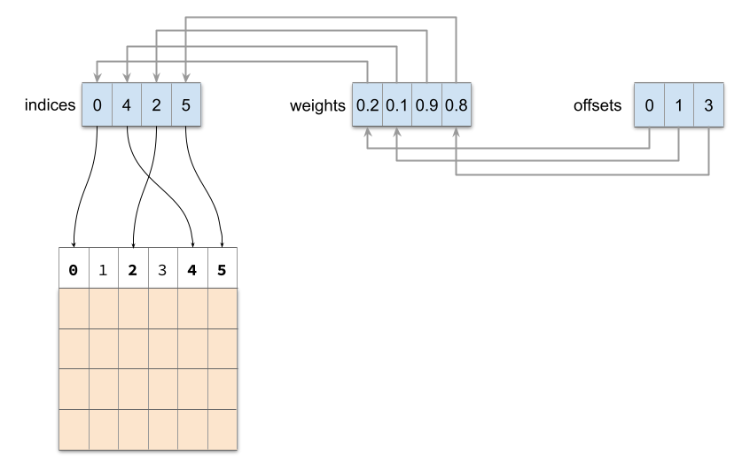

# Fully-vectorized weighted field embedding bags for recommender systems
PyTorch embedding bag module and factorization machine models for multi-value fields with weights per value. The implementations are *fully vectorized*. For example, imagine a data-set of movies where the "genres" column may contain a list of genres with corresponding weights representing a measure of confidence in the movie belonging to the genre.

The basic component of this package is the `WeightedEmbeddingBag` class, which is similar to the PyTorch `torch.nn.EmbeddingBag` class, but supports weights and bag aggregation in mini-batches. It receives three parameters: indices, offsets, and weights, depicted below.


The indices array selects embeddings, the weights array is used to multiply embeddings by a corresponding weight, and the offsets array defines the endpoints of each bag. In the example above, we select the embedding vectors $(v_0, v_4, v_2, v_5)$. They will be multiplied by the weights $(0.2, 0.1, 0.9, 0.8)$ and grouped into three bags, the first includes only $v_0$, the second only $v_4$, and the third includes $v_2$ and $v_5$. Consequently, the output will be

$$
0.2 \cdot v_0,\quad 0.1 \cdot v_4,\quad 0.9 \cdot v_2 + 0.8 \cdot v_5
$$

Since offsets point to the _end-point_ of each bag, we can use mini-batches with a variable number of embeddings, and make sure that the offsets array specifies the last bag to end before the padding of each sample.

On top, we have implemented the classical Factorization Machine model in the `WeightedFM` class, and a fully-vectorized version of a field-aware factorization machine in the `WeightedFFM` class.

## Usage
Example:

We implement the visualization in the previous section in one of the batches. The following creates a Weighted Embedding Bag with a ```6x4``` learnable matrix (the embeddings), where ```4``` is the embedding dimension:
```python
emb_bag = WeightedEmbeddingBag(6, 4)  
  ```
Then we create the forward parameters: ```indices```, ```weights``` and ```offsets```. ```indices``` is of dimension ```3x5```, where the ```3``` indicates that we are working with three batches. In the first batch we make the same selection as visualized in a previous section:
```python
indices = torch.IntTensor([[0, 4, 2, 5], [1, 1, 4, 5], [1, 2, 3, 5]])  
weights = torch.Tensor([[0.2, 0.1, 0.9, 0.8], [0.5, 0.2, 0.3, 0.3], [2., -2., 0.3, 0.6]])  
offsets = torch.IntTensor([[0, 1, 3], [0, 2, 3], [1, 2, 3]])
```
Finally, we can pass them as the forward parameters:
```python
output = emb_bag(indices, offsets, weights)  
```

### Detailed explanation
We provide a more detailed explanation of the previous example
  The embedding parameters can be seen by printing the  ```weight``` of the embeddings:
  ```python
  >>> emb_bag.emb.weight
  Parameter containing:
tensor([[-0.4172, -0.1485,  0.9262, -0.4852],
        [ 0.1526, -0.5395,  0.0916, -1.2741],
        [-0.3022, -0.0705, -0.1614, -0.2234],
        [ 0.8110, -0.2389,  0.7278, -0.1804],
        [ 1.3034,  1.2308, -0.3032,  1.7542],
        [ 0.2870, -3.3745,  1.4647, -0.4888]], requires_grad=True)
  ```
  We can print the forwarded parameters to see their dimensions more clearly:
```python 
>>> print("indices: \n", indices, indices.shape)  
... print("weights: \n", weights, weights.shape)  
... print("offsets: \n", offsets, offsets.shape)
indices: 
 tensor([[0, 4, 2, 5],
        [1, 1, 4, 5],
        [1, 2, 3, 5]], dtype=torch.int32) torch.Size([3, 4])
weights: 
 tensor([[ 0.2000,  0.1000,  0.9000,  0.8000],
        [ 0.5000,  0.2000,  0.3000,  0.3000],
        [ 2.0000, -2.0000,  0.3000,  0.6000]]) torch.Size([3, 4])
offsets: 
 tensor([[0, 1, 3],
        [0, 2, 3],
        [1, 2, 3]], dtype=torch.int32) torch.Size([3, 3])
```
Recall that ```indices``` will make selections from the embeddings (i.e. ```weight```). Let us take a look at the output, and you can verify that the first vector equals to the visualization above:
```python
>>> print("actual: \n", actual, actual.shape)
actual: 
 tensor([[[-0.0834, -0.0297,  0.1852, -0.0970],
         [ 0.1303,  0.1231, -0.0303,  0.1754],
         [-0.0424, -2.7630,  1.0265, -0.5921]],

        [[ 0.0763, -0.2697,  0.0458, -0.6370],
         [ 0.4215,  0.2613, -0.0726,  0.2714],
         [ 0.0861, -1.0124,  0.4394, -0.1466]],

        [[ 0.9096, -0.9380,  0.5059, -2.1014],
         [ 0.2433, -0.0717,  0.2183, -0.0541],
         [ 0.1722, -2.0247,  0.8788, -0.2933]]], grad_fn=<SubBackward0>) torch.Size([3, 3, 4])
```

## Installation
TODO - we will fill it when we publish the package to PyPI
